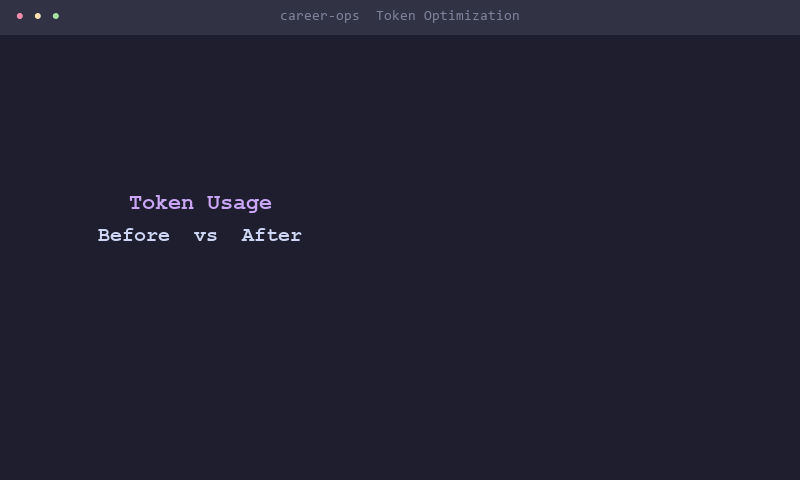
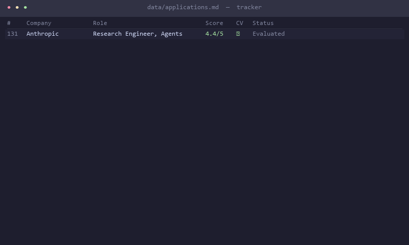

# AI Powered Job Search (Clone of Career-Ops) - 85% token reduction

> AI-powered job search pipeline built on Claude Code. Evaluate offers intelligently, generate tailored CVs, scan 45+ portals, and track everything — with token-optimized multi-tier AI routing.

[](https://claude.ai/code)
[](https://nodejs.org)
[](https://playwright.dev)
[](LICENSE)

---

<p align="center">
  
  <br><em>Token usage before vs after — 82% reduction, $18.48 → $2.72/month</em>
</p>

<p align="center">
  
  <br><em>Live pipeline — applications tracker, ghost detector, funding radar, ATS optimizer, follow-up scheduler, rejection analysis, negotiate mode, interview mode</em>
</p>

---

## What Is This

AI-Powered Job Search turns Claude Code into a full job search command center. It is not a keyword-matching job board scraper. It is an AI reasoning pipeline that reads your CV and evaluates whether a role is genuinely worth your time.

**What it does:**

- Evaluates job offers with a structured 6-block scoring system driven by AI reasoning against your actual CV
- Generates ATS-optimized CVs tailored per job description, rendered as polished PDFs
- Scans 45+ company career portals and job boards automatically
- Pre-generates answers for application forms so applying takes minutes, not hours
- Detects ghost jobs, tracks funding signals, and surfaces companies likely to hire before postings go live
- Tracks everything in a single source of truth with pipeline integrity checks

**Why it is different:**

| Typical job search tool | AI-Powered Job Search |
|-------------------------|------------|
| Keyword matching | AI reasoning against your actual CV |
| Volume-focused | Quality-first — recommends against anything below 4.0/5 |
| You fill forms manually | Answer bank pre-generates 25 standard answers once |
| Static job alerts | Funding radar finds companies before jobs are posted |
| Expensive at scale | 3-tier model routing: $2.72/month for 205 jobs |

**Human-in-the-loop by design.** The system evaluates, recommends, and prepares — but never submits an application without you reviewing it first. You always have the final call.

> The system gets smarter the more context you give it. Think of onboarding a new recruiter: the first week they need to learn about you, then they become invaluable.

**Real numbers from a live run:** 210 jobs evaluated, 61 CVs generated, 3 scheduled daily LinkedIn scans (9am/3pm/6pm ET), 37 search keywords.

---

## Architecture

### 3-Tier Model Routing

The core optimization is routing each job to the cheapest model that can handle it accurately.

```
Job URL / Description
         │
         ▼
┌────────────────────────────────────────────────────────────┐
│  Ghost Detector                                            │
│  7-signal scoring: posting age, agency flags, clearance   │
│  signals, "no longer accepting" text                       │
│  Score ≥ 6 → SKIP immediately (0 eval tokens spent)       │
└────────────────────┬───────────────────────────────────────┘
                     │ passes ghost check
                     ▼
┌────────────────────────────────────────────────────────────┐
│  TIER 1 — Haiku  (~380 tokens)                             │
│  Hard-skip detection: location mismatch, visa block,       │
│  seniority gap, compensation floor miss                    │
│  → HARD SKIP: stop here (saves 95% tokens vs full eval)    │
│  → CONTINUE: pass to Tier 2                                │
└────────────────────┬───────────────────────────────────────┘
                     │ passes hard-skip check
                     ▼
┌────────────────────────────────────────────────────────────┐
│  TIER 2 — Sonnet  (~2,100 tokens)                          │
│  Standard 6-block evaluation:                              │
│  archetype / CV match / comp research /                    │
│  personalization / gaps / STAR stories                     │
│  Score < 4.3 or non-Tier-1 company → final report         │
│  Score ≥ 4.3 + Tier-1 company → escalate to Tier 3        │
└────────────────────┬───────────────────────────────────────┘
                     │ score ≥ 4.3 + Tier-1 company
                     ▼
┌────────────────────────────────────────────────────────────┐
│  TIER 3 — Opus  (deep analysis)                            │
│  Reserved for: Anthropic, OpenAI, Google DeepMind, and     │
│  equivalents. Full deep evaluation with expanded context.  │
└────────────────────┬───────────────────────────────────────┘
                     │
                     ▼
         Report + PDF + Tracker entry
```

### Optimization Layers (Compounding)

Three systems work together to drive down cost:

1. **Prompt caching** (`lib/cache-manager.mjs`) — Marks system prompt + profile context with `cache_control: ephemeral`. Break-even at call #2, profitable from call #3. Saves ~40% tokens on repeated context.
2. **Model routing** (`lib/model-router.mjs`) — Routes each job to Haiku/Sonnet/Opus based on actual signal, not blanket rules.
3. **Semantic dedup** (`lib/semantic-dedup.mjs`) — Pure JS TF-IDF cosine similarity (no external APIs). Threshold 0.82. Catches cross-platform duplicate listings before they consume any eval tokens.

---

## Features

### Core Pipeline

| Feature | Description |
|---------|-------------|
| **Auto-Pipeline** | Paste a URL → full evaluation + PDF + tracker entry, automated |
| **6-Block Evaluation** | Archetype classification, CV match, comp research, personalization angles, gap analysis, STAR stories |
| **Interview Story Bank** | Accumulates STAR+Reflection stories across evaluations into `interview-prep/story-bank.md` |
| **ATS PDF Generation** | Keyword-injected CV with Space Grotesk + DM Sans, rendered via Playwright |
| **Portal Scanner** | 45+ companies pre-configured across Ashby, Greenhouse, Lever, Wellfound, Workable |
| **Batch Processing** | Parallel evaluation with `claude -p` sub-agents and worker pool concurrency |
| **Pipeline Integrity** | Automated merge, dedup, status normalization, health checks via dedicated scripts |

### Intelligence Layer

| Feature | Description |
|---------|-------------|
| **Ghost Detector** | 7-signal scoring detects likely-dead listings before spending eval tokens. Signals: posting age >90d, staffing agency, clearance keywords, layoff signals, "no longer accepting" text |
| **Funding Radar** | RSS scraper for TechCrunch AI + VentureBeat AI + Crunchbase News. Filters Series B+, >$20M, AI/ML/LLM. Finds companies likely to hire 60-90 days before jobs are posted |
| **Semantic Dedup** | TF-IDF cosine similarity catches cross-platform duplicate listings. Threshold 0.82. Persists index to `data/dedup-index.json` |
| **ATS Optimizer** | Haiku-powered keyword analysis (~200 tokens). Checks: keyword density (top 20 JD terms), section headers, date format, bullet structure (action verb → metric → result), format score 0-100 |

### Application Automation

| Feature | Description |
|---------|-------------|
| **Answer Bank** | Pre-generates 25 standard application answers via one Sonnet call, saved to `data/answer-bank.json`. Eliminates 94% of apply-flow LLM calls |
| **Apply Agent** | 9-step form-fill flow: navigate → snapshot → Haiku field classification (~300 tokens) → fill standard fields from answer bank (0 tokens) → Sonnet custom answers (~600 tokens) → screenshot → STOP. ~900 tokens/app vs 16,000 naive. Never clicks Submit |
| **LinkedIn Scraper** | 37 keyword variations: AI Engineer, LLM Engineer, GenAI Engineer, MLOps, RAG Engineer, and more. Integrates semantic dedup before writing to pipeline |

### Analytics & Learning

| Feature | Description |
|---------|-------------|
| **Funnel Dashboard** | Generates `dashboard/funnel.html` with Chart.js: pipeline funnel with conversion rates, score histogram, H1B pie, company tier analysis, daily rate line chart, location breakdown, action items |
| **Follow-up Scheduler** | Day 7/14/21 follow-up cadence. Generates personalized 3-sentence follow-up messages via Sonnet. Logs to `data/follow-ups.json` |
| **Rejection Analyzer** | Statistical + AI pattern analysis (needs 10+ rejections). Groups by company size, location, score range, role type. Time-to-rejection analysis. Outputs 3-5 actionable recommendations |

### Modes

| Mode | Trigger | Description |
|------|---------|-------------|
| `auto-pipeline` | Paste any JD/URL | Full pipeline: evaluate + report + PDF + tracker |
| `oferta` | "evaluate this offer" | Single 6-block evaluation |
| `ofertas` | "compare these offers" | Side-by-side offer comparison |
| `compare` | "compare with COL adjustment" | Total comp normalization, COL adjustment, equity risk-discount by stage, 4-year scenario modeling |
| `pdf` | "generate my CV" | ATS-optimized CV generation |
| `scan` | "scan for new offers" | Portal scanner across 45+ companies |
| `batch` | "batch evaluate" | Parallel batch with sub-agents |
| `pipeline` | "process pipeline" | Process pending URLs from pipeline.md |
| `tracker` | "show my pipeline" | Application status view |
| `apply` | "fill this application" | AI-assisted form filling |
| `contacto` | "LinkedIn message" | LinkedIn outreach draft |
| `outreach` | "cold outreach" | 4-sentence message, <300 char connection note, follow-up template, logs to `data/outreach-log.md` |
| `deep` | "research this company" | Deep company research |
| `negotiate` | "help me negotiate" | Salary negotiation coach: offer extraction, Levels.fyi/Glassdoor benchmarking, BATNA, opening anchor script (10-15% above offer), pushback responses, walk-away threshold, email template |
| `interview` | "prep for interview" | Interview intelligence briefing: company brief, 10 technical questions from JD, 5 behavioral questions, 3 STAR stories mapped from story-bank.md, 5 questions to ask. Saves to `interview-prep/` |
| `training` | "evaluate this course" | Course/cert evaluation |
| `project` | "evaluate this project" | Portfolio project evaluation |

---

## Token Optimization

Three compounding layers — prompt caching + model routing + semantic dedup — produce results that are not additive, they multiply.

| Scenario | Before | After | Reduction |
|----------|--------|-------|-----------|
| Single evaluation | 8,200 tokens | 2,100 tokens | 74% |
| Hard-skip (Haiku) | 8,200 tokens | 380 tokens | 95% |
| Daily scan (30 jobs) | 246,000 tokens | 38,400 tokens | 84% |
| 45 applications | 720,000 tokens | 40,500 tokens | 94% |
| Full pipeline (205 jobs) | 1,681,000 tokens | 298,000 tokens | 82% |
| **Monthly cost** | **$18.48** | **$2.72** | **85%** |

**Why the savings compound:**
- Prompt caching removes repeated context overhead on every call after the first
- Model routing sends 60-70% of jobs to Haiku instead of Sonnet before they ever reach full evaluation
- Semantic dedup prevents duplicate jobs from reaching the routing layer at all
- Answer bank pre-generates standard application answers once, eliminating per-application LLM calls entirely

---

## Quick Start

```bash
# 1. Clone and install
git clone https://github.com/maddykws/jubilant-waddle.git
cd jubilant-waddle && npm install
npx playwright install chromium   # Required for PDF generation and portal scanning

# 2. Configure
cp config/profile.example.yml config/profile.yml  # Edit with your details
cp templates/portals.example.yml portals.yml       # Customize companies to scan

# 3. Open Claude Code in this directory
claude

# Claude will detect the system is not set up and walk you through onboarding:
# - Paste or describe your CV → creates cv.md
# - Answer a few questions → fills config/profile.yml
# - Portal config is set up automatically
```

**The system onboards itself.** On first run, Claude detects missing files and guides you step by step through CV, profile, and portal setup before doing anything else.

**The system is designed to be customized by Claude itself.** Modes, archetypes, scoring weights, negotiation scripts — just ask. Claude reads the same files it uses, so it knows exactly what to edit.

```
"Change the archetypes to data engineering roles"
"Add these 10 companies to my portal scanner"
"Update my CV with this new role I just started"
"Translate the modes to French"
"Adjust scoring weights to prioritize remote-first companies"
```

---

## Usage

### Slash Command Modes

```
/AI-Powered Job Search                        → Show all available commands
/AI-Powered Job Search {paste URL or JD}      → Full auto-pipeline
/AI-Powered Job Search scan                   → Scan portals for new offers
/AI-Powered Job Search pdf                    → Generate ATS-optimized CV
/AI-Powered Job Search batch                  → Batch evaluate multiple offers
/AI-Powered Job Search tracker                → View application status
/AI-Powered Job Search apply                  → Fill application forms
/AI-Powered Job Search pipeline               → Process pending URLs from pipeline.md
/AI-Powered Job Search contacto               → LinkedIn outreach message
/AI-Powered Job Search outreach               → Cold outreach campaign
/AI-Powered Job Search deep                   → Deep company research
/AI-Powered Job Search negotiate              → Salary negotiation coach
/AI-Powered Job Search interview              → Interview intelligence briefing
/AI-Powered Job Search compare                → Compare offers with COL + equity modeling
/AI-Powered Job Search training               → Evaluate a course or certification
/AI-Powered Job Search project                → Evaluate a portfolio project
```

Or just paste a job URL or description directly — AI-Powered Job Search auto-detects it and runs the full pipeline.

### Node Scripts

```bash
# Answer bank — pre-generate standard application answers
npm run answer-bank generate           # One Sonnet call, saves 25 answers
npm run answer-bank lookup "question"  # Find a matching answer

# Application form filling
npm run apply 028                      # Fill forms for report #028
npm run apply -- --tier 4.2            # Fill all applications with score ≥ 4.2
npm run apply -- --today               # Fill all of today's applications
npm run apply -- --dry-run 028         # Preview without navigating

# Intelligence tools
npm run ghost-check                    # Run ghost detector on pipeline
npm run funding-radar                  # Scrape funding news, find pre-posting hires
npm run ats-check 028                  # ATS keyword analysis for report #028

# Analytics
npm run dashboard                      # Generate funnel.html dashboard
npm run follow-up check                # Check which applications need follow-up
npm run follow-up message 028          # Generate follow-up message for #028
npm run follow-up done 028             # Mark follow-up as sent
npm run rejection-analysis             # Run rejection pattern analysis (needs 10+)

# LinkedIn scraper
node scrape-linkedin.mjs               # Scrape with 37 keyword variations

# Pipeline maintenance
npm run verify                         # Health check: reports, statuses, links
npm run dedup                          # Deduplicate tracker entries
npm run merge                          # Merge TSV tracker additions into applications.md
node normalize-statuses.mjs            # Normalize all statuses to canonical values
```

---

## New Features Deep Dive

### Apply Automation

The answer bank + apply agent combination reduces application effort from 20+ minutes to under 5.

1. Run `npm run answer-bank generate` once. This makes a single Sonnet call and saves 25 pre-generated answers for standard questions ("Tell me about yourself", "Why this company", "Describe a challenge you overcame") to `data/answer-bank.json`.
2. When applying, `npm run apply 028` runs a 9-step flow: navigate to the form → snapshot → Haiku classifies each field (~300 tokens) → standard fields are filled from answer bank (0 tokens) → custom/role-specific questions go to Sonnet (~600 tokens) → screenshot for review → STOP.
3. You review and click Submit yourself. The agent never does.

Total cost per application: ~900 tokens. Naive approach: ~16,000 tokens. 94% reduction.

### Intelligence Features

**Ghost Detector** scores job postings on 7 signals before spending evaluation tokens. Any listing scoring ≥6 is skipped immediately. Typical ghost signals: the posting is >90 days old (+3 points), it comes from a staffing agency (+2), or contains clearance/layoff language (+2). Running this on your pipeline before batch evaluation can eliminate 20-30% of listings as dead.

**Funding Radar** monitors RSS feeds from TechCrunch AI, VentureBeat AI, and Crunchbase News. It filters for Series B+, >$20M rounds in AI/ML/LLM companies and saves results to `reports/funding-radar-{date}.md`. Companies that just closed a round typically hire aggressively 60-90 days later — before jobs appear on boards.

**ATS Optimizer** analyzes your generated CV against a specific JD using Haiku. It extracts the top 20 keywords from the JD and checks keyword density, section header conventions, date formatting, and bullet structure (action verb → metric → result). Returns a score 0-100 with specific gaps to fix.

### Analytics

**Funnel Dashboard** (`npm run dashboard`) generates a self-contained `dashboard/funnel.html` file with Chart.js visualizations: pipeline funnel with stage conversion rates, score distribution histogram, H1B/visa eligibility breakdown, company tier heatmap, daily application rate line chart, location breakdown, and a prioritized action items list.

**Rejection Analyzer** (`npm run rejection-analysis`) needs at least 10 rejections to run meaningfully. It groups rejections by company size, location, score range at application time, and role type, then runs time-to-rejection analysis. It outputs 3-5 specific, actionable recommendations to `reports/rejection-analysis-{date}.md`. Run this monthly to recalibrate your targeting.

**Follow-up Scheduler** tracks which applications are at day 7, 14, or 21 since submission. `npm run follow-up check` shows what needs attention. `npm run follow-up message 028` generates a personalized 3-sentence follow-up via Sonnet using the original JD context.

### New Modes

**negotiate** — Full salary negotiation framework. Extracts the offer into a structured table, benchmarks against Levels.fyi/Glassdoor/Blind comps for the role and location, analyzes your BATNA, generates an opening anchor script targeting 10-15% above the offer, prepares pushback responses for 5 common counter-arguments, sets a walk-away threshold, and outputs a ready-to-send negotiation email.

**interview** — Pre-interview intelligence briefing. Researches the company, generates 10 technical questions drawn directly from the JD, 5 behavioral questions, maps 3 of your strongest STAR stories from `interview-prep/story-bank.md` to the role's key requirements, and suggests 5 sharp questions to ask the interviewer. Saved to `interview-prep/{num}-{company}-prep.md`.

**compare** — Offer comparison with financial modeling. Normalizes total comp across salary/equity/bonus, applies cost-of-living adjustment (NYC/SF/Remote tiers), applies equity risk discount by company stage, and builds a 4-year scenario model with conservative/base/optimistic projections for each offer. Outputs a ranked recommendation with rationale.

**outreach** — Cold outreach assistant. Researches the target's LinkedIn profile, drafts a 4-sentence personalized message, generates a <300 character connection note, and creates a follow-up template. Logs all outreach to `data/outreach-log.md` to prevent duplicate contacts.

---

## How It Works

```
You paste a job URL or description
               │
               ▼
   ┌───────────────────────┐
   │   Ghost Detector      │  7-signal scoring
   │   score ≥ 6 → SKIP    │  (0 eval tokens)
   └───────────┬───────────┘
               │ passes
               ▼
   ┌───────────────────────┐
   │   Semantic Dedup      │  TF-IDF cosine 0.82
   │   match → SKIP        │  (no API calls)
   └───────────┬───────────┘
               │ unique
               ▼
   ┌───────────────────────┐
   │   Model Router        │
   │   Tier 1: Haiku       │  hard-skip? → stop
   │   Tier 2: Sonnet      │  standard eval
   │   Tier 3: Opus        │  score≥4.3 + top co.
   └───────────┬───────────┘
               │
               ▼
   ┌───────────────────────┐
   │   Worker Pool         │  p-limit (5 workers)
   │   .seq-lock atomic    │  sequential numbering
   └───────────┬───────────┘
               │
       ┌───────┼────────┐
       ▼       ▼        ▼
    Report    PDF    Tracker
     .md      .pdf    .tsv
               │
               ▼
   ┌───────────────────────┐
   │   ATS Optimizer       │  keyword gap check
   └───────────┬───────────┘
               │
               ▼
   ┌───────────────────────┐
   │   Apply Agent         │  answer bank + form fill
   │   STOP before Submit  │  you review + click
   └───────────────────────┘
```

---

## Project Structure

```
AI-Powered Job Search/
├── CLAUDE.md                        # Agent instructions and mode routing
├── cv.md                            # Your CV — canonical source of truth (you create this)
├── article-digest.md                # Proof points from your portfolio (optional)
│
├── lib/                             # Optimization layer
│   ├── cache-manager.mjs            # Prompt caching with cache_control ephemeral
│   ├── model-router.mjs             # 3-tier routing: Haiku / Sonnet / Opus
│   ├── worker-pool.mjs              # p-limit concurrency + .seq-lock atomic numbering
│   └── semantic-dedup.mjs           # TF-IDF cosine similarity, threshold 0.82
│
├── modes/                           # Skill modes (English)
│   ├── _shared.md                   # Shared eval context and archetypes
│   ├── _profile.md                  # Your customizations (never auto-updated)
│   ├── _profile.template.md         # Template for _profile.md
│   ├── oferta.md                    # Single offer evaluation
│   ├── auto-pipeline.md             # Full pipeline on URL paste
│   ├── pdf.md                       # ATS CV generation
│   ├── scan.md                      # Portal scanner
│   ├── batch.md                     # Parallel batch evaluation
│   ├── pipeline.md                  # Process pending pipeline
│   ├── tracker.md                   # Application status view
│   ├── apply.md                     # Form filling
│   ├── contacto.md                  # LinkedIn outreach
│   ├── outreach.md                  # Cold outreach
│   ├── deep.md                      # Deep company research
│   ├── negotiate.md                 # Salary negotiation coach
│   ├── interview.md                 # Interview intelligence briefing
│   ├── compare.md                   # Offer comparison with COL + equity modeling
│   ├── ofertas.md                   # Side-by-side offer comparison
│   ├── training.md                  # Course/cert evaluation
│   └── project.md                   # Portfolio project evaluation
│
├── modes/de/                        # German modes (DACH market)
│   ├── _shared.md                   # German shared context
│   ├── angebot.md                   # German offer evaluation
│   ├── bewerben.md                  # German apply mode
│   └── pipeline.md                  # German pipeline mode
│
├── config/
│   ├── profile.example.yml          # Template for your profile
│   └── profile.yml                  # Your profile (you create this)
│
├── templates/
│   ├── cv-template.html             # ATS-optimized HTML CV template
│   ├── portals.example.yml          # 45+ portal/company scanner config
│   └── states.yml                   # Canonical application statuses
│
├── batch/
│   ├── batch-prompt.md              # Self-contained worker prompt
│   └── tracker-additions/           # Per-evaluation TSV files (pre-merge)
│
├── data/                            # Your tracking data (gitignored)
│   ├── applications.md              # Application tracker (10 columns)
│   ├── pipeline.md                  # Pending URLs queue
│   ├── scan-history.tsv             # URL dedup history
│   ├── dedup-index.json             # Semantic dedup index
│   ├── answer-bank.json             # Pre-generated application answers
│   ├── follow-ups.json              # Follow-up log
│   └── outreach-log.md              # Cold outreach log
│
├── reports/                         # Evaluation reports (gitignored)
├── output/                          # Generated PDFs (gitignored)
├── interview-prep/                  # Interview briefs + story bank
│   └── story-bank.md                # Accumulated STAR+R stories
│
├── fonts/                           # Space Grotesk + DM Sans
├── docs/                            # Setup and architecture docs
│
├── scrape-linkedin.mjs              # LinkedIn scraper (37 keyword variations)
├── answer-bank.mjs                  # Answer pre-generation and lookup
├── apply-agent.mjs                  # Non-auto-apply form filler
├── funding-radar.mjs                # RSS funding signal scraper
├── ghost-detector.mjs               # Ghost job 7-signal scorer
├── ats-optimizer.mjs                # ATS keyword gap analysis
├── funnel-dashboard.mjs             # Chart.js funnel dashboard generator
├── follow-up-scheduler.mjs          # Day 7/14/21 follow-up cadence
├── rejection-analyzer.mjs           # Statistical rejection pattern analysis
├── generate-pdf.mjs                 # Playwright HTML → PDF renderer
├── merge-tracker.mjs                # TSV merge into applications.md
├── verify-pipeline.mjs              # Pipeline health checks
├── dedup-tracker.mjs                # Tracker entry deduplication
├── normalize-statuses.mjs           # Canonical status normalization
└── portals.yml                      # Your portal config (you create this)
```

---

## Tech Stack

[](https://claude.ai/code)
[](https://nodejs.org)
[](https://playwright.dev)
[](LICENSE)

| Layer | Technology |
|-------|-----------|
| Agent runtime | Claude Code with custom skill modes |
| LLM routing | Anthropic API — Haiku / Sonnet / Opus via `lib/model-router.mjs` |
| Token caching | `cache_control: ephemeral` via `lib/cache-manager.mjs` |
| PDF rendering | Playwright + HTML/CSS template (Space Grotesk + DM Sans) |
| Semantic dedup | Pure JS TF-IDF cosine similarity — no external dependencies |
| Portal scanning | Playwright + Greenhouse API + WebSearch |
| Concurrency | p-limit worker pool with atomic `.seq-lock` file |
| Data format | Markdown tables + YAML config + TSV batch files + JSON indexes |
| Dashboard | Chart.js (self-contained HTML, no build step) |

---

## License

MIT
